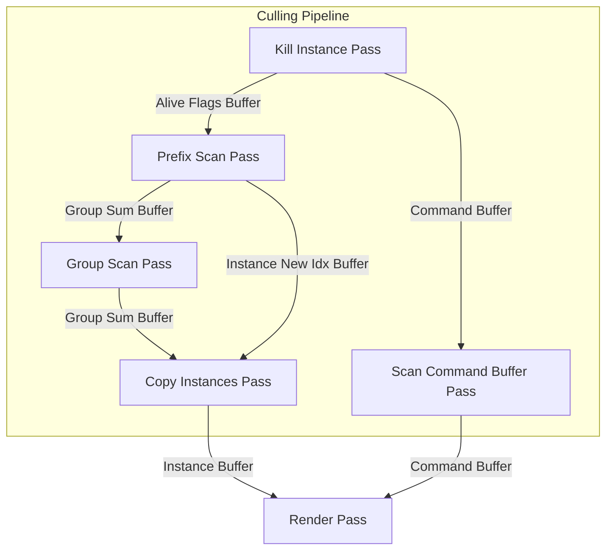
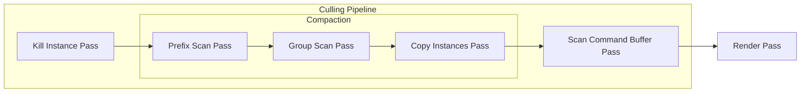

## migrate to work graph

### rules

- 如果要啟用 work graph，要在 defines.h define GR_WORKGRAPH
- dispatch 方式統一採用 broadcasting
- 統一定義節點屬性 NodeMaxDispatchGrid 為 defines.h 裡面的值
- dispatch grid 參考 defines.h --> OcclusionPassCB
    - 記得使用 ROOT_SIG_B1 宣告 Root Signature
    - Root Signature 都是宣告在 hlsl 裡面
- 整個 work graph 的 dispatch 尺寸，的方式是在 work graph 裡面的 entry point 來決定的，cpp 端只要 dispatchGraph(1,1,1)

### todo

- [ ] 把當前的 work graph 也修正
    - 1. [x] 傳入 OcclusionPassCB 到 dummy wg，並在 CullInstancePass.h 修改 Root argument 的傳入
    - 2. [x] 和 KillInstancePass 一樣，使用 OcclusionPassCB 的值來決定 dispatch 大小

## todo

- 效能優化
    - [ ] 優化 material 數量, now numMaterial == numMeshes
    - [ ] 優化紋理數量，現在 numTexture == numMeshes * 3

## pipeline chart

