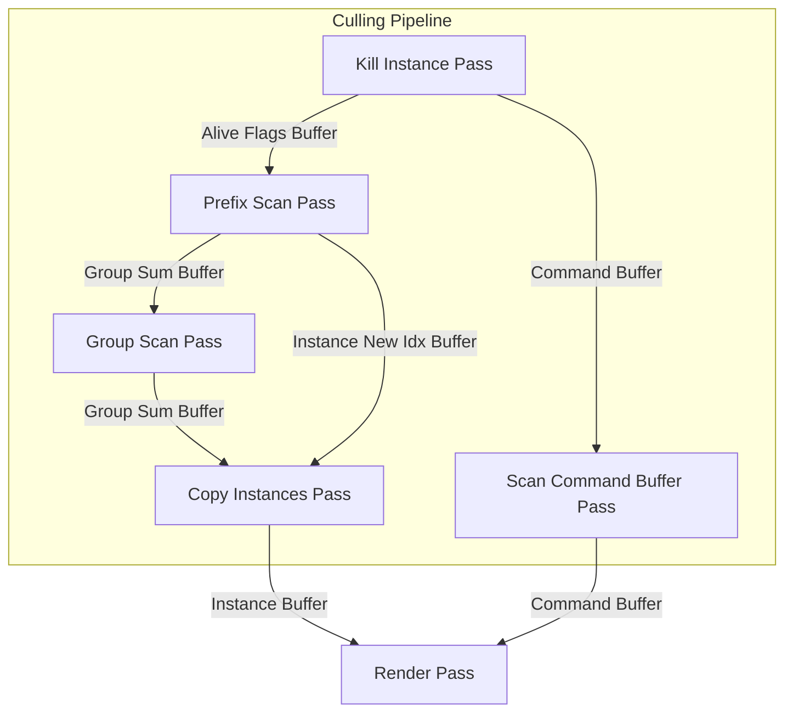
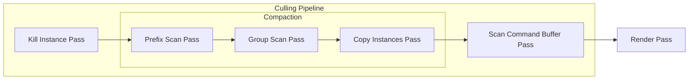

1. 實現 work graph 版本 kill instances pass
    - [ ] 更改 dummy pass，加入 kill instances 的邏輯
        - work graph 的 dispatch 前後，是用一樣的方法管理 resource state 嗎？
            - 在 App 端是一樣的，用 barrier 管理資源狀態
            - 在 Graph 內部，也有 barrier 可用於管理內部的資源依賴
            - 發布很多 thread，每個 thread 對應一個 instance
            - broadcasting: 一個 record，一個 dispatch grid
            - 等待整個 grid 執行完，發起下一個 record（整個 grid 一個 record）
            - entry -- 1 record --> [ grid(noof_instance/noof_threads) ]
    - [ ] Dummy.hlsl --> 新增 resource binding
    - [ ] CullInstancePass --> dispatch wg () --> set root argument
    - [ ] how to dispatch grid
2. 實現整個 pipeline 用 work graph dipatch，但一樣每個 pass 都只有不根據 record 來 dispatch
3. 使用 record 和適當的 launch mode

- [x] 升級 command list
    - 修改傳進來的型別

## workgraph

- HLSL
    1. 把函數加上 [Shader("node")]
    2. [NodeDispatchGrid(x, y, z)]
- init
    1. 把 hlsl 編譯成 library
    2. 創建 state object
    3. 分配 backing memory
- render:
    1. ID3D12Resource
    2. DispatchGraph

## next week

- tier 1
    - [x] 支援更多 instance
        - [x] 實作 clear buffer pass (創建 uav srv cbv heap?)
            1. 把該清零的 <--> 沒有外部資料 dependencies 的，搬進來 pass 內部，並且封裝 buffer size
                - group_sum_buffer, scanned_group_sum_buffer, alive_buffer, newpos_buffer
            2. 傳入 command buffer 的 buffer size
            3. 把 buffer size 們都 pass 進去 clear pass
            4. 發起 clear pass
        - [ ] 爲什麽把 out command 清零會出錯？
            - default
            - default_proccessed
            - default --> default_proccessed
            - render: proccessed, no_culling
    - [ ] workgraph 版本

- future
    - [ ] 有那些 workgraph 可以優化的空間？e.g. 根據 intermediate 的結果來節省掉不必要的 dispatch
    - [ ] 當前 pipeline 的 workgraph 版本移植
    - [ ] 优化原子加法 wave intrinsics

- done
    - [x] 重畫 Culling Pipeline 圖片
    - [x] 實作 instance data parser
    - [x] belloch prefix sum 正確性説明
    - [x] 更換 mesh 
    - [x] thread group size 的設置原理
    - [x] 封裝 resource
    - [x] multi-mesh 的 instance 剔除
    - [x] single-mesh instance 剔除
    - [x] refactor code

## todo

- 效能優化
    - [ ] 優化 material 數量, now numMaterial == numMeshes
    - [ ] 優化紋理數量，現在 numTexture == numMeshes * 3

## pipeline chart

