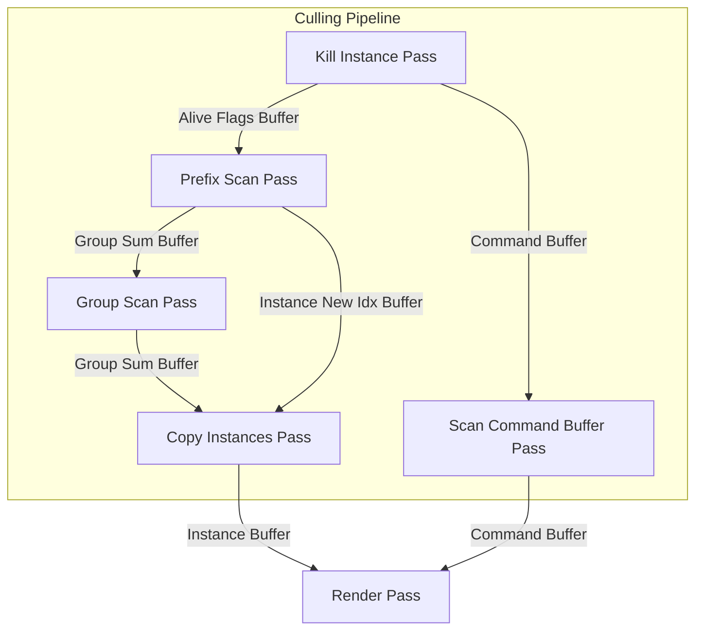

## next week

- tier 1
    - [ ] 用 Nsight 來分析 naive compute shader 的效能
    - [ ] 更換 mesh 
- tier 2
    - [ ] thread group size 的設置原理
    - [ ] 有那些 workgraph 可以優化的空間？e.g. 根據 intermediate 的結果來節省掉不必要的 dispatch
    - [ ] 當前 pipeline 的 workgraph 版本移植
    - [ ] 优化原子加法 wave intrinsics
- tier 3
    - [ ] belloch prefix sum 正確性説明
- done
    - [x] 封裝 resource
    - [x] multi-mesh 的 instance 剔除
    - [x] single-mesh instance 剔除
    - [x] refactor code

## todo

- 規格
    - [ ] drawcall compaction
- 效能優化
    - [ ] 優化 material 數量, now numMaterial == numMeshes
    - [ ] 優化紋理數量，現在 numTexture == numMeshes * 3

## pipeline chart

