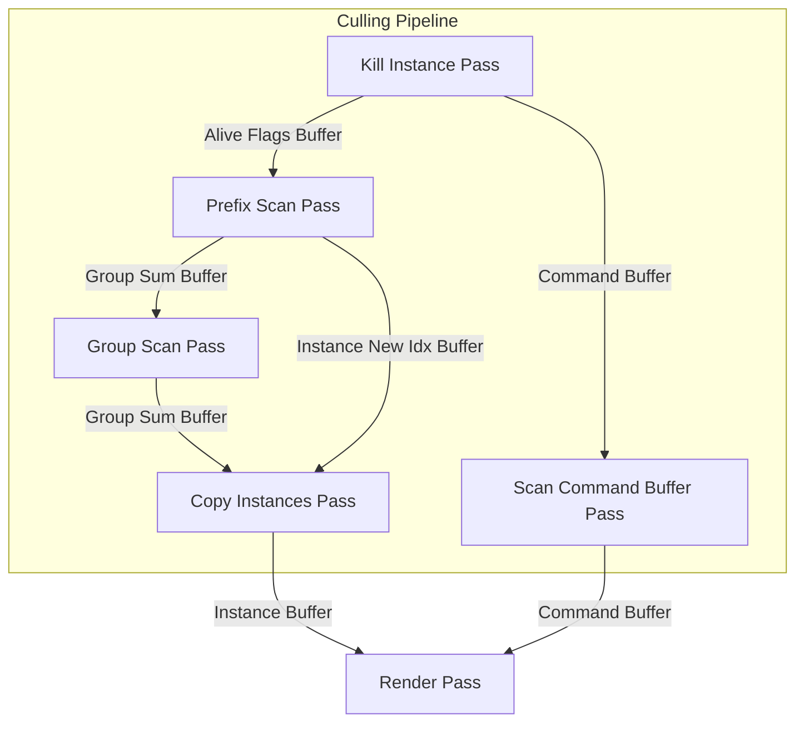
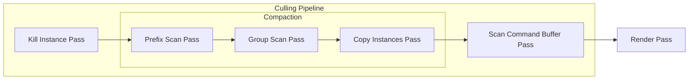

## next week

- tier 1
    - [ ] 支援更多 instance
        - [ ] 實作 clear buffer pass (創建 uav srv cbv heap?)
            1. 把該清零的 <--> 沒有外部資料 dependencies 的，搬進來 pass 內部，並且封裝 buffer size
                - group_sum_buffer, scanned_group_sum_buffer, alive_buffer, newpos_buffer
            2. 傳入 command buffer 的 buffer size
            3. 把 buffer size 們都 pass 進去 clear pass
            4. 發起 clear pass
    - [ ] workgraph 版本
    - [ ] 統一 buffer size 的創建

- future
    - [ ] 有那些 workgraph 可以優化的空間？e.g. 根據 intermediate 的結果來節省掉不必要的 dispatch
    - [ ] 當前 pipeline 的 workgraph 版本移植
    - [ ] 优化原子加法 wave intrinsics

- done
    - [x] 重畫 Culling Pipeline 圖片
    - [x] 實作 instance data parser
    - [x] belloch prefix sum 正確性説明
    - [x] 更換 mesh 
    - [x] thread group size 的設置原理
    - [x] 封裝 resource
    - [x] multi-mesh 的 instance 剔除
    - [x] single-mesh instance 剔除
    - [x] refactor code

## todo

- 效能優化
    - [ ] 優化 material 數量, now numMaterial == numMeshes
    - [ ] 優化紋理數量，現在 numTexture == numMeshes * 3

## pipeline chart

