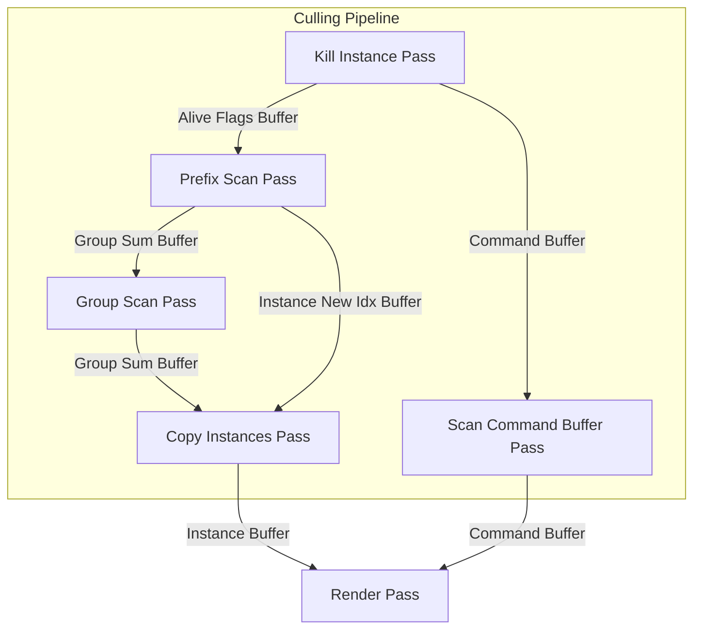
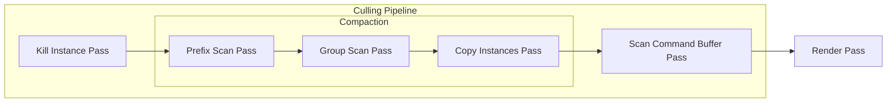

## migrate to work graph

### rules

- 如果要啟用 work graph，要在 defines.h define GR_WORKGRAPH
- dispatch 方式統一採用 broadcasting
- 統一定義節點屬性 NodeMaxDispatchGrid 為 defines.h 裡面的值
- dispatch grid 參考 defines.h --> OcclusionPassCB
    - 記得使用 ROOT_SIG_B1 宣告 Root Signature
    - Root Signature 都是宣告在 hlsl 裡面
- 整個 work graph 的 dispatch 尺寸，的方式是在 work graph 裡面的 entry point 來決定的，cpp 端只要 dispatchGraph(1,1,1)


### todo

- [x] 把當前的 work graph 也修正
    - 1. [x] 傳入 OcclusionPassCB 到 dummy wg，並在 CullInstancePass.h 修改 Root argument 的傳入
    - 2. [x] 和 KillInstancePass 一樣，使用 OcclusionPassCB 的值來決定 dispatch 大小

### 如何在代碼層面移植到 work graph

1. **資源綁定方式的差異**：
```hlsl
// KillInstancesCS.hlsl - 使用 RootSignature 屬性
[RootSignature(
    ROOT_SIG_B1
    "SRV(t0), "
    "UAV(u0), "
    "UAV(u1)")]

// Dummy_wg.hlsl - 使用 GlobalRootSignature 結構
GlobalRootSignature globalRS = { 
    ROOT_SIG_B1 "SRV(t0), UAV(u0), UAV(u1)"
};
```

2. **執行模型差異**：
```hlsl
// KillInstancesCS.hlsl - 傳統 Compute Shader
[numthreads(NOOF_THREADS, 1, 1)]
void main(uint3 DTid : SV_DispatchThreadID, uint3 groupId : SV_GroupID, uint3 groupThreadId : SV_GroupThreadID)

// Dummy_wg.hlsl - Work Graph 節點
[Shader("node")]
[NodeLaunch("broadcasting")]
[NodeDispatchGrid(MAX_NOOF_INSTANCES/NOOF_THREADS_KILL_INSTANCES,1,1)]
[NumThreads(NOOF_THREADS, 1, 1)]
void secondNode(
    RWDispatchNodeInputRecord<secondNodeInput> inputData,
    uint threadIndex : SV_GroupIndex,
    uint dispatchThreadID : SV_DispatchThreadID)
```

3. **新增的數據結構**：
```hlsl
// Dummy_wg.hlsl - 新增的節點間通信結構
struct entryRecord
{
    uint pad;  // ignore
};

struct secondNodeInput
{
    uint gridSize : SV_DispatchGrid;
};

struct thirdNodeInput
{
    uint entryRecordIndex;
};
```

4. **新增的調度控制節點**：
```hlsl
// Dummy_wg.hlsl - 新增的 firstNode 用於控制調度
[Shader("node")]
[NodeLaunch("broadcasting")]
[NodeDispatchGrid(1,1,1)]
[NumThreads(1, 1, 1)]
void firstNode(
    DispatchNodeInputRecord< entryRecord> inputData,
    [MaxRecords(1)] NodeOutput<secondNodeInput> secondNode,
    uint threadIndex : SV_GroupIndex,
    uint dispatchThreadID : SV_DispatchThreadID)
{
    GroupNodeOutputRecords<secondNodeInput> outRecs = secondNode.GetGroupNodeOutputRecords(1);
    outRecs[0].gridSize = noof_instances / NOOF_THREADS + 1;
    outRecs.OutputComplete();
}
```

5. **同步機制差異**：
```hlsl
// KillInstancesCS.hlsl - 使用 DeviceMemoryBarrierWithGroupSync
DeviceMemoryBarrierWithGroupSync();

// Dummy_wg.hlsl - 使用 Work Graph 的內建同步機制
// 通過節點間的數據流來實現同步
```

6. **參數傳遞差異**：
```hlsl
// KillInstancesCS.hlsl - 直接使用 SV_DispatchThreadID 等系統值
uint idx = DTid.x;

// Dummy_wg.hlsl - 通過節點輸入記錄傳遞參數
uint idx = dispatchThreadID.x;
```

主要的代碼差異在於：
1. Work Graph 版本需要更多的結構定義來支持節點間的通信
2. 執行模型從單一的 Compute Shader 變成了多節點的 Work Graph
3. 同步機制從顯式的屏障變成了隱式的節點間數據流
4. 參數傳遞方式從系統值變成了節點輸入記錄
5. 資源綁定方式從 RootSignature 屬性變成了 GlobalRootSignature 結構

這些差異反映了 Work Graph 的設計理念：更靈活的執行模型和更清晰的數據流。


## todo

- 效能優化
    - [ ] 優化 material 數量, now numMaterial == numMeshes
    - [ ] 優化紋理數量，現在 numTexture == numMeshes * 3

## pipeline chart



