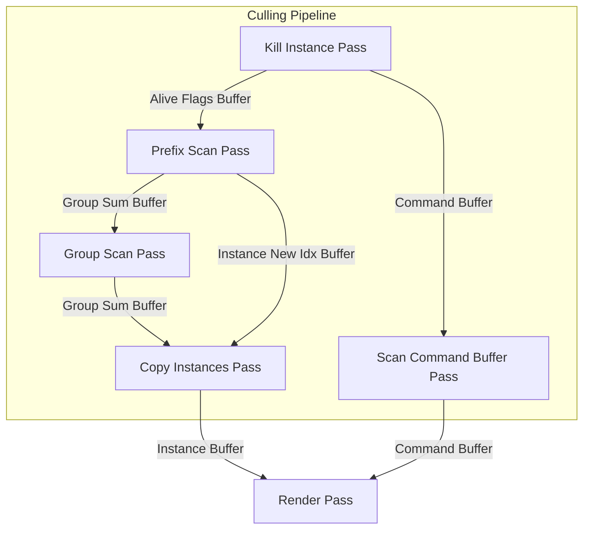
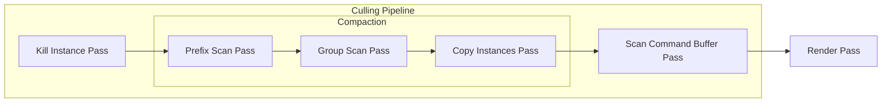

[[toc]]

## dump hash

- [ ] 移除 createRootSignatureFromSubobjectLib API
  - create root signature from shader
    - workgraph 的 global root signature 和正常的 shader 的 root signature 不一樣的，可以直接呼叫 CreateRootSignature 創建嗎？

## future todo

- 效能優化
    - [ ] 優化 material 數量, now numMaterial == numMeshes
    - [ ] 優化紋理數量，現在 numTexture == numMeshes * 3

## pipeline chart

